# Lab2Web
## Nama : KEMAS RAFI RAMADHAN
## NIM  : 312310346
## kelas :TI 23 A.4
## 1. Membuat file baru praktikum2,menambahkan tag CSS dasar,dan membuat dokumen HTML.
- Gambar1
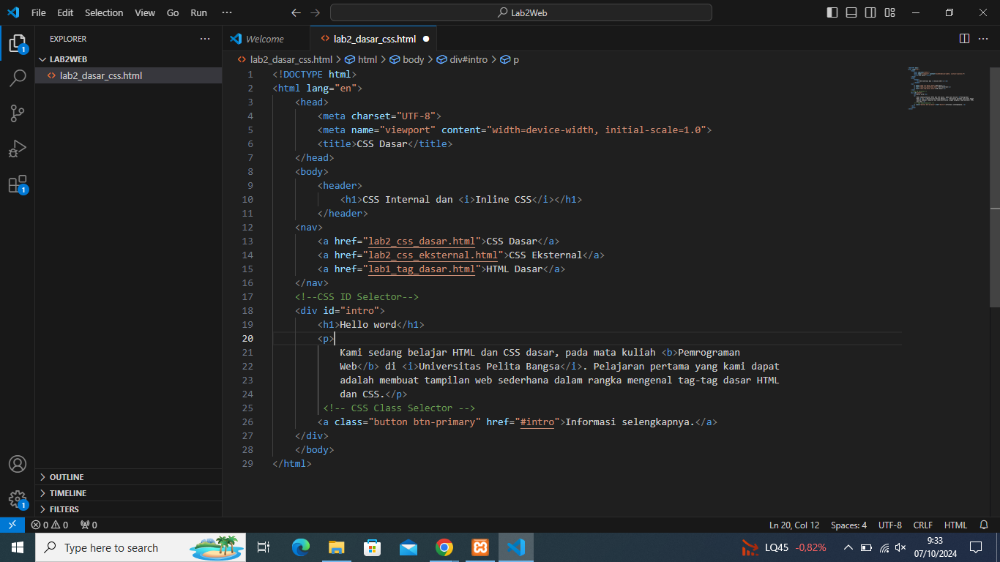
- Gambar2
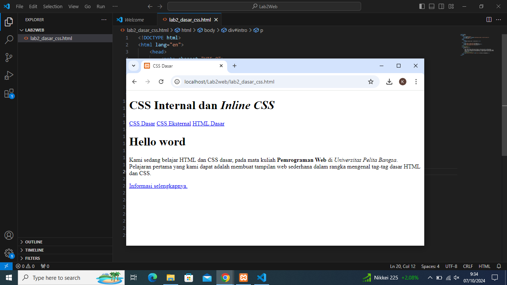
## 2. Kemudian membuat file css dengan nama style css
- Gambar 1
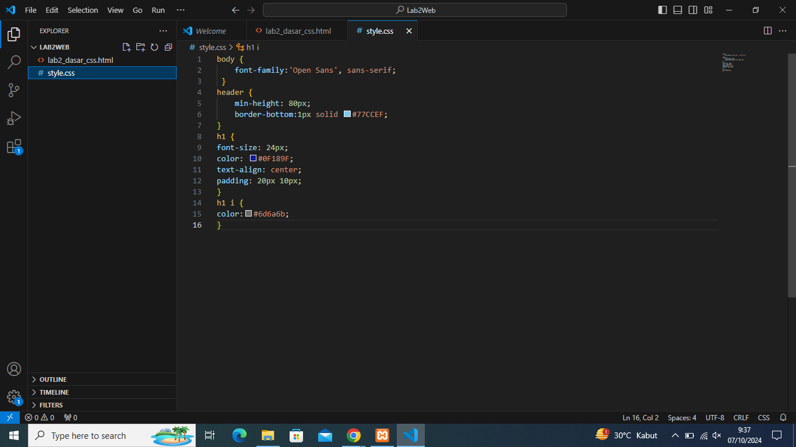
- Gambar result
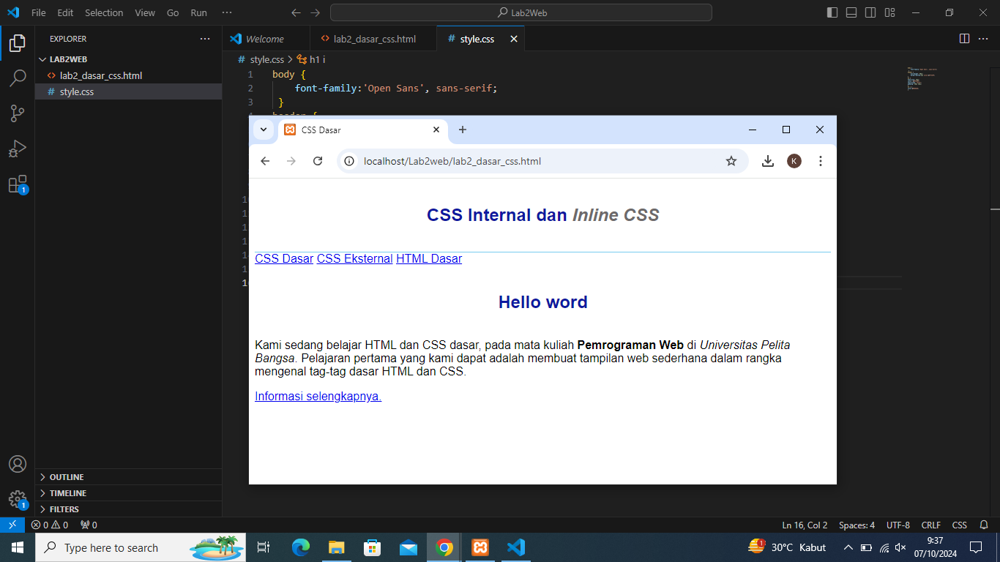
## 3. Tambahkan inline css di file HTML, supaya paragraf yg kita buat berubah 
- Gambar 1
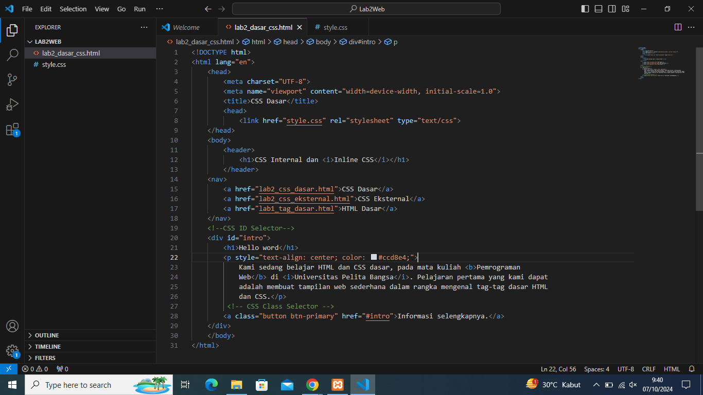
- Gambar result 1
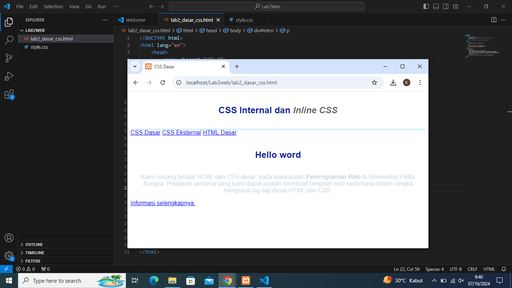
## 4. Kemudian membuat file baru css eksternal dengan nama style_eksternal.css, lalu tambahkan tag link di HTML untuk merujuk file css yang sudah dibuat pada bagian head
- Gambar 1
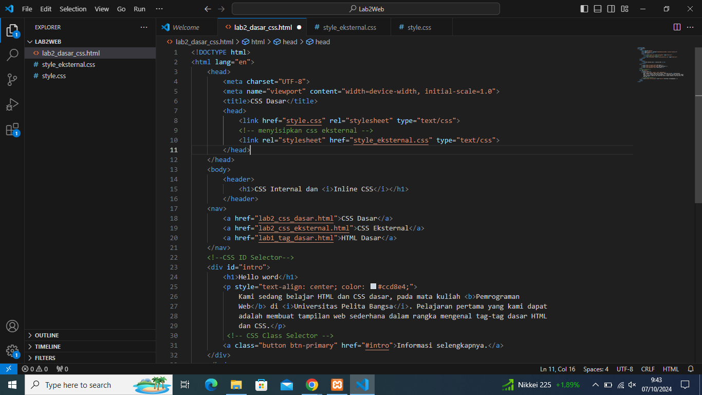
- Gambar 2 style_eksternal.css
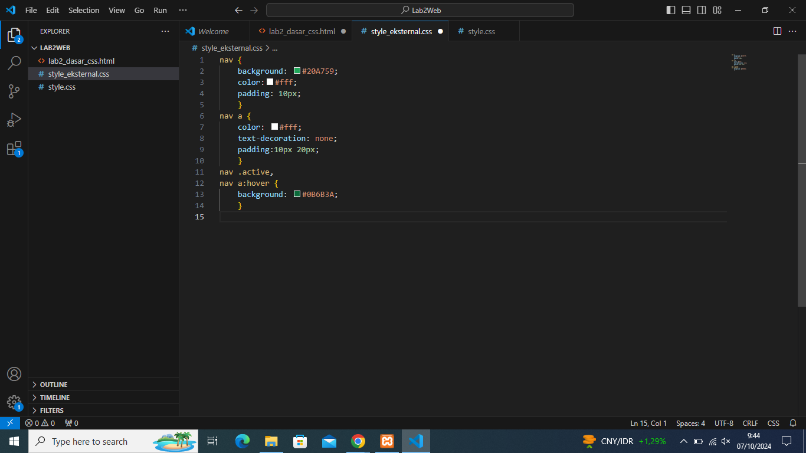
- Gambar result 1&2
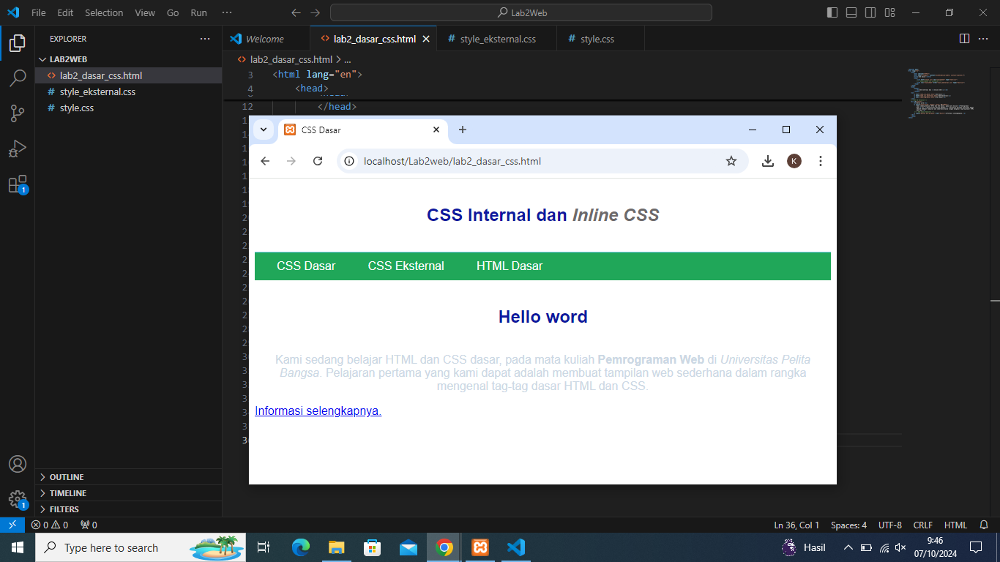
## 5. Menambahkan CSS selector menggunakan ID dan Class Selector. pada file style_eksternal.css
- Gambar 1
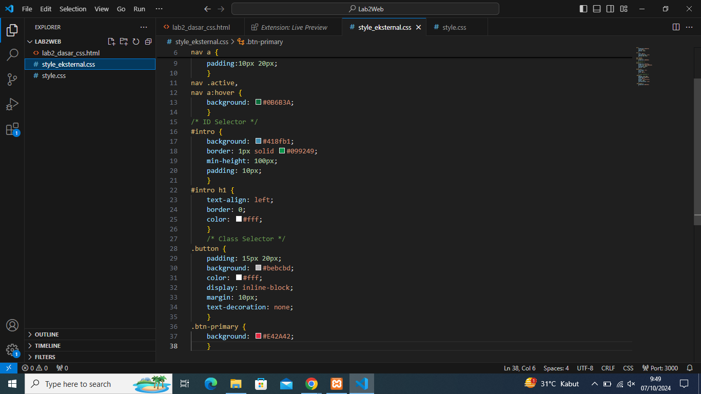
- Gambar Result 1
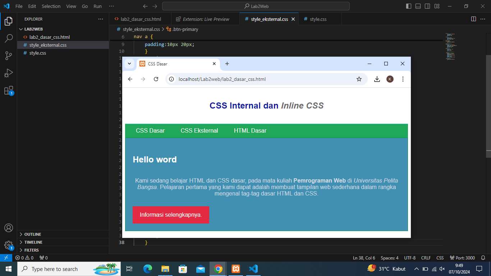
